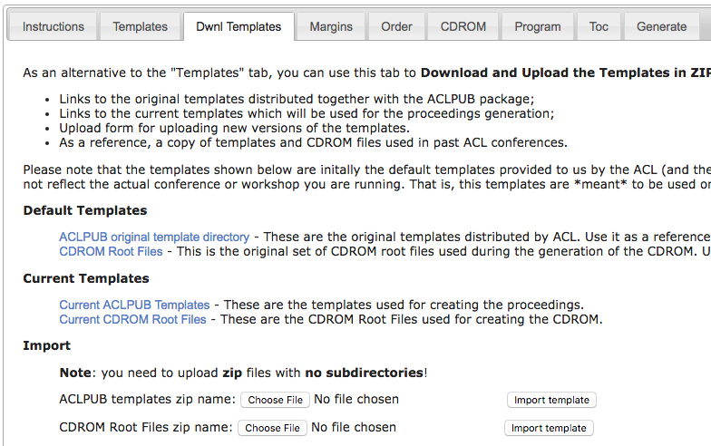
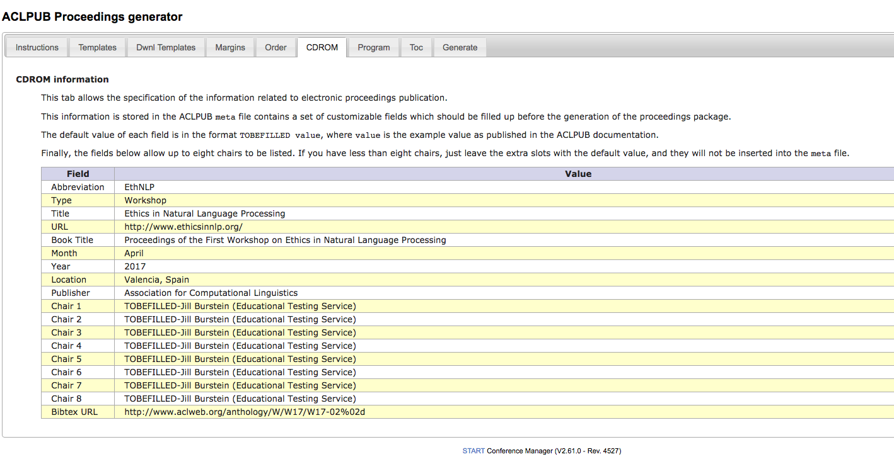

# How to produce proceedings for ACL Conferences and Workshops

## Table of Contents
1. [tl;dr](#tldr)

2. [Introduction](#introduction)

3. [Instructions](#instructions)

   [Step One:  Margins Tab](#step-one--margins-tab)

   [Step Two:  Dwnl Templates Tab](#step-two--dwnl-templates-tab)

   [Step Three:  Order Tab](#step-three--order-tab)
   
   [Step Four:  Templates Tab](#step-four--templates-tab)

   [Step Five:  Online Proceedings Tab (CDROM)](#step-five--cdrom-tab-online-proceedings-tab)
   
   [Step Six:  Program](#step-six--program-tab)
   
   [Step Seven:  Toc](#step-seven--toc-tab)
   
   [Step Eight:  Generate!](#step-eight--generate-tab)

4. [What to Look Out For](#what-to-look-out-for)

5. [Notes](#notes)

6. [Authors](#authors)

## tl;dr

1. Go to https://www.softconf.com/acl2017/${WSAbbreviation}/pub/scmd.cgi?scmd=ACLPUB, where ${WSAbbreviation} is your workshop abbreviation on softconf.

2. Click on each tab, left to right, and do what it says, top-down.
<kbd>

</kbd>

3. Your goal is to get to the last step, Generate "All", under the "Generate" tab, without any errors.
<kbd>

</kbd>

## Introduction

This page is for conference organizers (main conference, workshop &
demo chairs) who need to put together a book for inclusion in the
ACL proceedings. 

You will need your ACL ID Prefix and your ISBN number.
You can find those here, in [this ACL 2017 Workshops google doc](https://docs.google.com/spreadsheets/d/1x1RtUjAy-S_YhvTXWTrUc5xs9_4HkF0pOGynhRE963M/edit?usp=sharing).

You should be able to produce your proceedings entirely within the START manager console.  Once your book builds without error using the `All` button under the
Generate tab, let the publications chairs know by e-mailing us at
[acl-pub-chairs@googlegroups.com](mailto:acl-pub-chairs@googlegroups.com).
We will collect the books online using START. There is no need to
e-mail us any zipped files.

We will update this page periodically with ACL 2017-specific details and answers to frequently
asked questions as they arise. If you encounter any problems with this
process, please email us.

## Instructions

To produce the proceedings book: 

1. Go to your workshop's softconf website.
   >  https://www.softconf.com/acl2017/${WSAbbreviation}, where ${WSAbbreviation} is your workshop abbreviation on softconf.

2. Go to the Publication Console (/pub). 
   >  https://www.softconf.com/acl2017/${WSAbbreviation}/pub

3. Under **Conference Program**, follow the `ACLPUB` link.   
   <kbd>
   
   </kbd>
   > This will bring you to the url:  https://www.softconf.com/acl2017/${WSAbbreviation}/pub/scmd.cgi?scmd=ACLPUB

4. Now you should see the `ACLPUB Proceedings Generator`.
   <kbd></kbd>

   This Proceedings Generator creates two things:
      -  A book proceedings, based in latex.
      -  An online proceedings, based in html.  Compiling the book proceedings end-to-end also produces the online proceedings.
   
   To compile the book proceedings, we use the ACLPUB Proceedings Generator to edit the following files:
   
   | File              | Role in Proceedings |
   | ----------------- | --------------------------- |
   | `titlepage.tex`   | Title Page. |
   | `copyright.tex`   | Copyright Page.  Where ISBN and Sponsor Logos go. |
   |  `preface.tex`    | Preface Page.  Welcomes readers to the proceedings and gives some detail on the event. |
   |  `organizers.tex` | Organizers Page.  Lists the organizing committee, program committee, invited speakers, panelists, etc. |
   |  `toc.tex`        | Table of Contents Page.  This will be filled out automatically, but you can customize if you want. |
   |  `program.tex`    | Schedule Page.  This too fill be filled out automatically, but you can customize if you want.|
   |  `spine.tex`      | Book Spine, for use in the printed handbook. |
   |  `citation-stamp.tex` | The Proceedings Footer.  Gives the citation details of the conference.  Appears on the bottom of the first page of each article in the proceedings. |   
   | `order` | Determines the author ordering in the proceedings and the schedule. |
   | `copyright-signatures` | Authors' copyright signatures, so the conference can print their work. |

   We edit those files in the Proceedings Generator using the following tabs:

   | Tab Name           | What That Means                         | Files                                                    |
   | ------------------ | --------------------------------------- | -------------------------------------------------------- |
   | Templates          | Proceedings Front Matter Files          | `titlepage.tex`, `copyright.tex`, `preface.tex`, `organizers.tex`, `toc.tex`, `program.tex` |
   | Dwnl Templates     | All Proceedings .tex and media files    | `.zip` files containing all `.tex` and media files, `order` file |
   | Margins            | Margins                                 | All author `.pdf` files |
   | Order              | Schedule & Author Ordering              | `order` file |
   | CDROM              | THE MOST IMPORTANT TAB                  | `.html` files for online proceedings |
   | Program            | Proceedings Program and Table of Contents     | `program.tex`, `toc.tex`|
   | Toc                | toc.tex, again                          | `toc.tex` |
   | Generate           | Compile full proceedings                | `copyright-signatures`, `.tgz` file of book and online proceedings. |

We now follow with how to edit those files in the ACLPUB Proceedings Generator, step by step.

### Step by Step Compilation in the softconf ACLPUB Proceedings Generation

#### Step One:  Margins Tab
 <kbd>
 
 </kbd>
 
Use this tab to correct the margins on the papers in the proceedings.  Going to this tab should display a table of the first 10 papers.  To see all the papers, change the `Page length` value to more than the number of papers you received, e.g., `100`.  

To see the current margins for each paper in the table:  In the left column, click on the rightmost `Edit Submission`.  This is circled in red in the example image.  This will bring you to the authors' final uploaded paper, where you can take a look at how well the margins fit.

You can also change margins by clicking on the cell all the way to the right -- this will bring up the Margins adjustment, circled in red in the image. 

#### Step Two:  Dwnl Templates Tab
  <kbd>
 
 </kbd>
 
Download the ACLPUB `.zip` file, add in your sponsorship logos, rezip, and upload.

#### Step Three:  Order Tab
 <kbd>  </kbd>

This tab creates the file called `order`.
 
The `order` file is used to format and order the papers in the
proceedings, in the schedule, and also to generate the handbook. 
The latter can be a
complex task, making sure that the schedule is formatted correctly and
consistently, and pulling together times across workshops (like the
student research workshop and the main proceedings). Since this is
done in LaTeX, it's important that the schedules be formatted to be
computer-readable.
 
 You can either:
   1. Use the Schedule Maker, to figure out your schedule, and get the `order` file created from that. 
   2. Use the text in the textbox as the `order` file, editing directly using the given markup.
 
 If you use the ScheduleMaker tool, the order file is generated automatically and should be to spec.
 If you edit by the `order` file by hand, remember:

-  Times should be specified in 24-hour format (implicit AM/PM):

       + 12:00--13:30 Lunch

   **This is very important for things like the digital handbook!**

-  Time ranges should be fully specified, with two dashes in between
    (and no spaces). Don't put just the start time.

       17 9:00--9:30 # A really great paper

-  Do not put time ranges in parentheses

-  Can also make sure your file passes [this verification script](files/verify_order.py). E.g.,

       $ cat proceedings/order | python verify_order.py
       Found 0 errors
       
**Order File**

The  `order` file below is from SSST-7 at NAACL 2013. You can use it
as a template. 

    * Thursday, June 13, 2013
    + 9:15--9:30 Opening Remarks
 
     = Session 1
    8 9:30--10:00 # A Semantic Evaluation of Machine Translation Lexical Choice
    6 10:00--10:30 # Taste of Two Different Flavours: Which Manipuri Script works better for English-Manipuri Language pair SMT Systems?
    + 10:30--11:00 Break

    = Session 2
    7 11:00--11:30 # Hierarchical Alignment Decomposition Labels for Hiero Grammar Rules
    3  11:30--12:00 # A Performance Study of Cube Pruning for Large-Scale Hierarchical Machine Translation
    4  12:00--12:30 # Combining Word Reordering Methods on different Linguistic Abstraction Levels for Statistical Machine Translation
    + 12:30--14:00 Lunch

    = Session 
    + 14:00--15:00 Panel discussion: Meaning Representations for Machine Translation, with Jan Hajic, Kevin Knight, Martha Palmer and Dekai Wu
    9 15:00--15:30 # Combining Top-down and Bottom-up Search for Unsupervised Induction of Transduction Grammars
    + 15:30--16:00 Break

    = Session 4
    2 16:00--16:30 # A Formal Characterization of Parsing Word Alignments by Synchronous Grammars with Empirical Evidence to the ITG Hypothesis.
    5 16:30--17:00 # Synchronous Linear Context-Free Rewriting Systems for Machine Translation       
       

#### Step Four:  Templates Tab
 <kbd>  </kbd>

 
**Copyright Page**

  [copyright.tex](files/copyright.tex) 

  Fill out the ISBN here.  This can be found [in the Google spreadsheet](https://docs.google.com/spreadsheets/d/1x1RtUjAy-S_YhvTXWTrUc5xs9_4HkF0pOGynhRE963M/edit?usp=sharing).  This is also where to use the \includegraphics tex call for sponsor logos. 
  
  
#### Step Five:  CDROM Tab (Online Proceedings Tab)
 <kbd>  </kbd>

 You will need to fill out this tab with the correct values for your volume, 
many of which can be found [here](https://docs.google.com/spreadsheets/d/1x1RtUjAy-S_YhvTXWTrUc5xs9_4HkF0pOGynhRE963M/edit?usp=sharing).
As an example, here are the values used for the main conference proceedings:

    Abbreviation    ACL-HLT
    Type	        Main Conference
    Title	        The 2017 Annual Meeting of the Association for Computational Linguistics
    URL	            http://acl2017.org
    Book Title	    Proceedings of the 2017 Annual Meeting of the Association for Computational Linguistics
    Month	        July-August
    Year	        2017
    Location	    Vancouver, Canada
    Publisher	    Association for Computational Linguistics
    Chair 1	        Kevin Knight (USC Information Sciences Institute)
    Chair 2	        Ani Nenkova (University of Pennsylvania) 
    Chair 3	        Owen Rambow (Columbia University)
    Chair 4	        TOBEFILLED-Jill Burstein (Educational Testing Service)
    Chair 5	        TOBEFILLED-Jill Burstein (Educational Testing Service)
    Chair 6	        TOBEFILLED-Jill Burstein (Educational Testing Service)
    Chair 7	        TOBEFILLED-Jill Burstein (Educational Testing Service)
    Chair 8	        TOBEFILLED-Jill Burstein (Educational Testing Service)
    Bibtex URL	    http://www.aclweb.org/anthology/P17-1%03d

**The correct value** for `Bibtex URL` can be found [here](https://docs.google.com/spreadsheets/d/1x1RtUjAy-S_YhvTXWTrUc5xs9_4HkF0pOGynhRE963M/edit?usp=sharing).

The `Bibtex URL` uses **8 characters to identify the conference/workshop and paper**, after the `http://www.aclweb.org/anthology/` prefix.  **You must make sure that the Bibtex URL provides for these 8 characters**. 

For an ACL main event in year 2017 (long papers, short papers, demos, student research workshop), the 8 characters will begin with `P17-`.  This stands for "ACL, 2017". For a workshop in year 2017, the 8 characters will begin with `W17-`.  This stands for "Workshop, 2017".  

The first values after the hyphen identify the workshop or ACL event.
The remaining values specify the paper ID.  **Remember to add %03d or %02d, depending on how many characters are remaining to add the paper IDs and make up the full 8 characters.  %03d specifies 3 digits, %02d specificies 2 difits**

For example, by specifying http://www.aclweb.org/anthology/P17-1%03d, we can create, e.g., http://www.aclweb.org/anthology/P17-1000.pdf.  
For workshops, we provide you with enough prefix that you need to specify just %02d additional following digits.  For example, if you're the 5th workshop listed, your bibtex URL will look like this: 

    Bibtex URL	    http://www.aclweb.org/anthology/W17-05%02d
    
#### Step Six:  Program Tab

  (may be able to skip)
 

#### Step Seven:  Toc Tab

  (may be able to skip)
 

#### Step Eight:  Generate Tab

 <kbd>
 </kbd>

## What to Look Out For

### Paper formatting

Please make sure that all of your papers meet the camera-ready standards as laid
out <a href="camera-ready-faq.html">in this document</a>. In particular, there are four main
areas of compliance you should look for:

1. *Margins*. Papers should fit entirely within the margins prescribed by the
   conference booklet. The [ACLPUB HOWTO](aclpub-howto-2017.html)
   provides detailed instructions on how to adjust
   margin offsets for papers that need to be shifted.

1.  *Black & White readability*. Papers can contain color images, charts, and
    figures, but they should all be interpretable when printed or viewed in grayscale.

1. *References*. Please make sure there are no obvious problems with the formatting of
   the References section.
   
1. *Metadata*. Please make sure there are no obvious problems with the
   formatting of names in the metadata for each paper (which is
   viewable from the proceedings draft index). In particular, authors
   should be aware that their names
   [will be formatted according to how they have entered it](camera-ready-faq.html#name-formatting)
   on their Softconf unified user info page.

### Schedules

You will need to produce a schedule for your workshop/session while
generating the proceedings.  **The schedule deadline is the same as
the book deadline!** Please follow the instructions in the
[ACLPUB HOWTO](aclpub-howto-2017.html), or take a look at this
[sample order file from SSST-7](files/sample-order.txt). 
Schedules are built from the proceedings `order` file, which you can either
edit manually in START's provided textbox or which you can create with the Excel-based `Schedule Maker` tool.

See the [Order][#order] section above for more.

## Notes
Earlier instructions on book assembly can be found under the Instructions tab in START as well.

## FAQ

## Authors

This [git repository](https://github.com/acl-org/acl-pubs) 
is currenty maintained by the 2017 ACL publications chairs advisor, 
[Margaret Mitchell](http://www.m-mitchell.com/).

The material
included in it has evolved over many years through the work of a 
large number of volunteers, including past NAACL publications chairs
[Margaret Mitchell](http://www.m-mitchell.com/),
[Adam Lopez](http://homepages.inf.ed.ac.uk/alopez/),
[Matt Post](http://www.cs.jhu.edu/~post/),
[Colin Cherry](https://sites.google.com/site/colinacherry/),
[Nizar Habash](http://www.nizarhabash.com/),
[Claudia Leacock](https://www.linkedin.com/in/claudialeacockphd),
[Joakim Nivre](http://stp.lingfil.uu.se/~nivre/),
[Matt Post](http://www.cs.jhu.edu/~post/),
[Noah Smith](http://www.cs.cmu.edu/~nasmith/),
[William Schuler](https://www.ling.ohio-state.edu/~schuler/),
and
[Richard Wicentowski](http://www.cs.swarthmore.edu/~richardw/).
